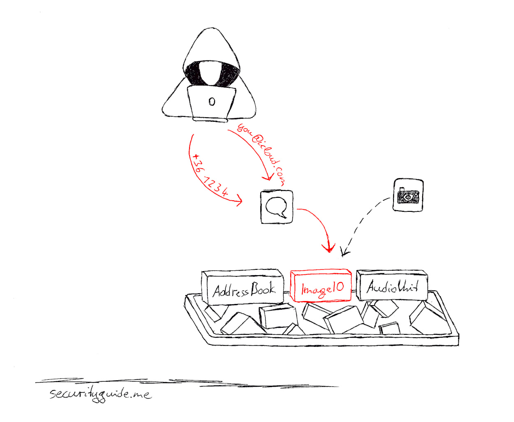

# How to protect from Pegasus spyware and nation-state attacks

**A spyware company hacks phones without user interaction. Can a phone be used without being monitored? Or do we have to accept that we cannot do anything against nation-state attacks? Let's disrupt the attack chain!**

Find some background info in my [blog post](https://securityguide.me/issues/dirty-phone-and-clean-phone).

## Dirty phone
I guess you will want to have a smartphone where you can browse the internet, chat with family and friends and maybe also play a game from time to time. This is what you do with your "dirty phone". Assume this phone might be compromised at some point in time.  

*Do you think that you might be a victim of targeted attacks by nation-state attackers?
* **No?** Great! The dirty phone is the only phone you need!
* **Yes?** You will still need a dirty phone for daily tasks. And if the nation-state is not able to compromise your phone, they will probably plant a bug into your office.

[Start to set up your dirty phone](README.md).

## Clean phone
Your clean phone is the phone where we want to prevent nation-state attacks. Nation-states must somehow identify your phone. They usually do this by your email address or your phone number. This is where we could disrupt the attack chain.

[Start to set up your clean phone](clean_phone.md).

